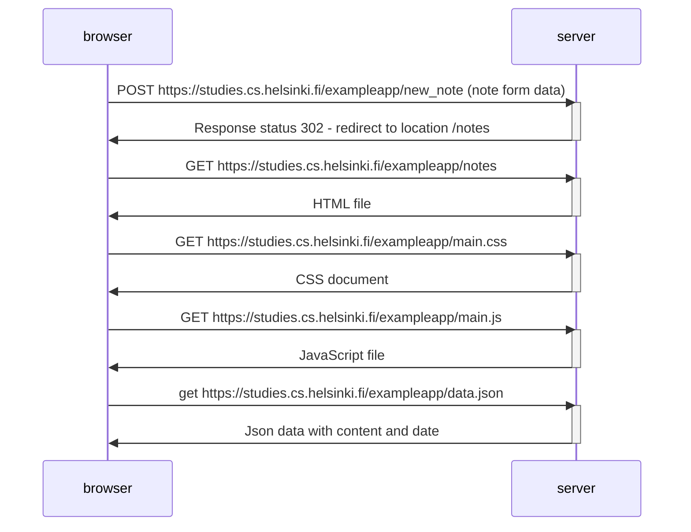

# New Note

Sequence diagram for creating a new note with the notes app:

```mermaid
sequenceDiagram
  participant browser
  participant server

  browser->>server: POST https://studies.cs.helsinki.fi/exampleapp/new_note (note form data)
  activate server
  server->>browser: Response status 302 - redirect to location /notes
  deactivate server

  browser->>server: GET https://studies.cs.helsinki.fi/exampleapp/notes
  activate server
  server->>browser: HTML file
  deactivate server

  browser->>server: GET https://studies.cs.helsinki.fi/exampleapp/main.css
  activate server
  server->>browser: CSS document
  deactivate server

  browser->>server: GET https://studies.cs.helsinki.fi/exampleapp/main.js
  activate server
  server->>browser: JavaScript file
  deactivate server

  browser->>server: get https://studies.cs.helsinki.fi/exampleapp/data.json
  activate server
  server->>browser: Json data with content and date
  deactivate server

```

